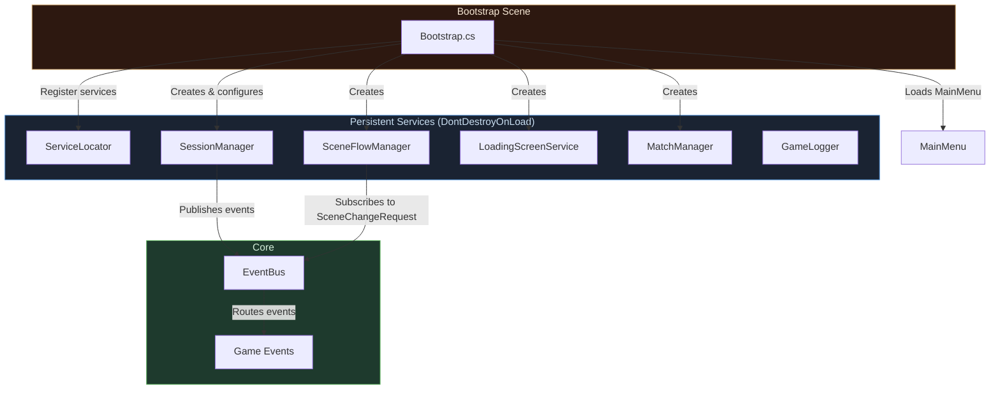
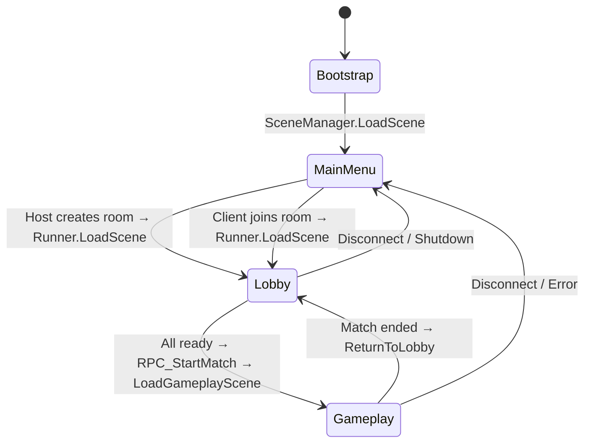
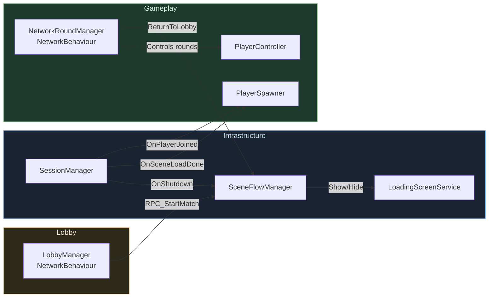
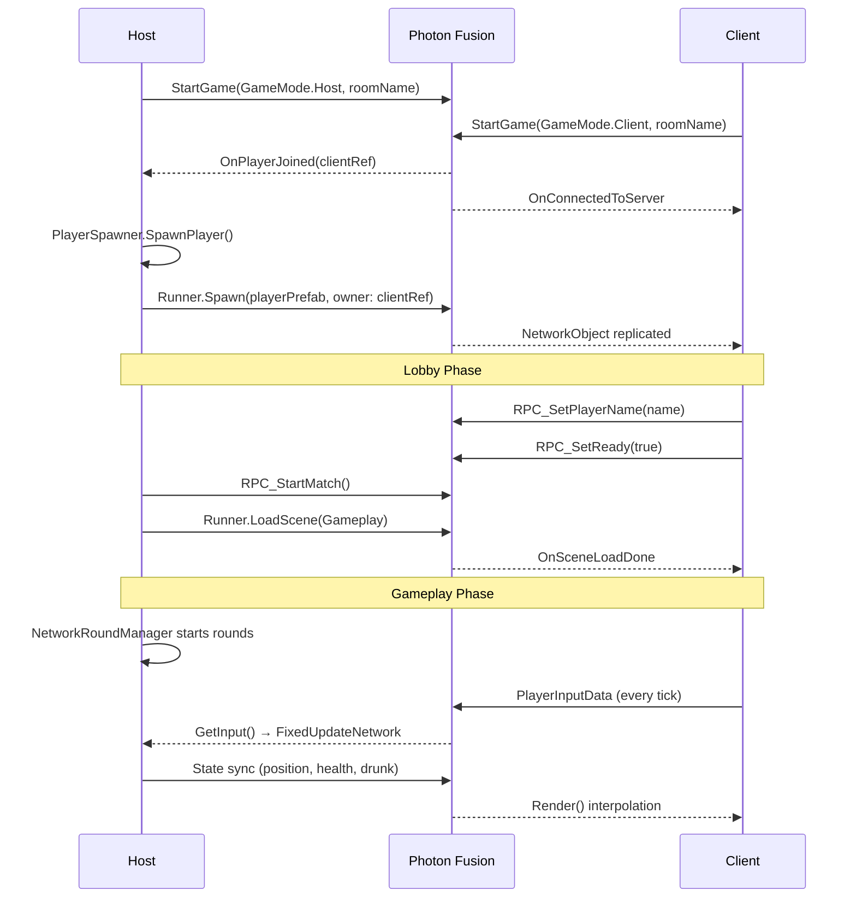
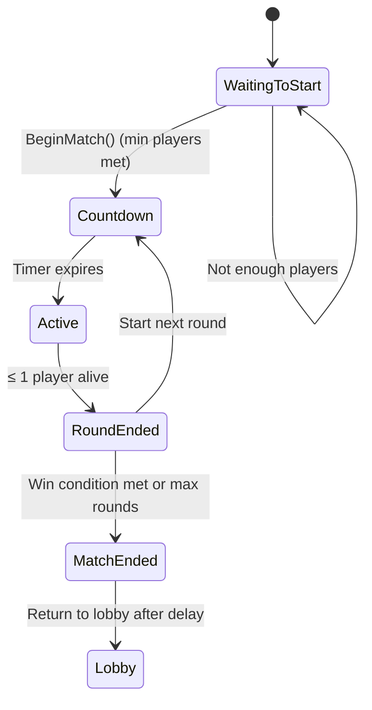

<p align="center">
  
</p>

<h1 align="center">🤠 Drunk Cowboys</h1>

<p align="center">
  <b>A chaotic multiplayer FPS where drunken cowboys settle the score in the Wild West</b>
</p>

<p align="center">
  
  
  
  
  
  
</p>

<p align="center">
  
  
</p>

---

## Overview

**Drunk Cowboys** is a multiplayer first-person shooter built in Unity, where players take on the role of cowboys in a Wild West town — with a twist: **alcohol is both a weapon and a curse**.

Players compete in round-based matches using revolvers in a dusty Western environment. Scattered across the map are **whiskey bottles** that increase a player's **drunk level**. Getting drunk increases **damage output** and grants **damage resistance**, but progressively impairs **aim accuracy**, **movement speed**, **weapon sway**, and **reload time** — creating a high-risk, high-reward gameplay loop.

> **Core Concept**: The drunker you get, the harder you hit — but the worse you shoot.

### Key Gameplay Pillars

| Pillar | Description |
|--------|-------------|
| **Risk vs. Reward** | Alcohol boosts damage but degrades aim, movement, and reload speed |
| **Round-Based Combat** | Best-of-N rounds with configurable win conditions |
| **Online Multiplayer** | Up to 8 players via Photon Fusion 2 with Host/Client model |
| **Wild West Theme** | Saloons, banks, carriages, cacti, and desert skyboxes |

---

## Technologies

| Technology | Version | Purpose |
|------------|---------|---------|
| **Unity** | `6000.3.8f1` (Unity 6) | Game engine |
| **Photon Fusion 2** | Latest | Networked multiplayer (state sync, RPCs, tick-based simulation) |
| **C#** | 12+ | Game logic and systems |
| **Universal Render Pipeline (URP)** | `17.3.0` | Rendering pipeline |
| **Cinemachine** | `3.1.6` | Camera system and drunk noise FX |
| **Input System** | `1.18.0` | Action-based player input |
| **Animation Rigging** | `1.4.1` | Procedural aim rig (multi-aim constraints) |
| **TextMeshPro** | (bundled) | UI text rendering |
| **Unity AI Navigation** | `2.0.10` | NavMesh (future AI/NPC support) |
| **Vivox** | `16.10.0` | Voice chat integration (available) |
| **Unity Multiplayer Playmode** | `2.0.2` | Local multi-client testing |

---

## Architecture

Drunk Cowboys follows a **Service Locator + Event Bus** architecture with clear separation between infrastructure, networking, lobby, gameplay, and UI layers.

### Architectural Overview



### Scene Flow



### Core Services

| Service | Interface | Responsibility |
|---------|-----------|----------------|
| **SessionManager** | `ISessionManager` | Owns `NetworkRunner`, creates/joins rooms, handles player join/leave/spawn callbacks |
| **SceneFlowManager** | `ISceneFlowManager` | Listens for `SceneChangeRequest`, orchestrates scene transitions via `Runner.LoadScene` |
| **LoadingScreenService** | `ILoadingScreenService` | Programmatically builds and manages a modal loading overlay with animated dots |
| **MatchManager** | `IMatchManager` | Tracks match running state |
| **ServiceLocator** | (static) | Generic service registry with `Register<T>`, `Get<T>`, `TryGet<T>` |
| **EventBus** | (static) | Pub/sub event system with `Subscribe<T>`, `Unsubscribe<T>`, `Publish<T>` |

### Manager Relationships



---

## Multiplayer Flow

### Networking Architecture

Drunk Cowboys uses **Photon Fusion 2** in **Host/Client** mode with **Multiple Peer** scene management.



### Networked State Sync

| Data | Sync Method | Authority |
|------|-------------|-----------|
| Player position/rotation | `NetworkCharacterController` | State Authority (Host) |
| Health, alive status | `[Networked]` properties | State Authority |
| Drunk level | `[Networked]` property | State Authority |
| Weapon ammo, reload state | `[Networked]` properties | State Authority |
| Lobby player list | `NetworkLinkedList<LobbyPlayerEntry>` | State Authority |
| Round state, countdown | `[Networked]` properties | State Authority |
| Round wins | `NetworkDictionary<PlayerRef, int>` | State Authority |
| Player name | `NetworkString<_32>` | State Authority (via RPC) |

### RPCs

| RPC | Source | Target | Description |
|-----|--------|--------|-------------|
| `RPC_SetPlayerName` | All | State Authority | Sets player display name |
| `RPC_SetReady` | All | State Authority | Toggles ready status |
| `RPC_StartMatch` | All | State Authority | Initiates match start |
| `RPC_KickPlayer` | State Authority | All | Disconnects a player |
| `RPC_ApplyDamage` | All | State Authority | Applies damage to a health system |
| `RPC_PlayFireFx` | State Authority | All | Triggers muzzle VFX and bullet visuals |

---

## Project Structure

```
Assets/
├── 3Dmodel/                          # 3D environment models (FBX/OBJ)
│   ├── saloon.fbx                    # Saloon building
│   ├── Bank.fbx                      # Bank building
│   ├── Western Town House 1.fbx      # Town house
│   ├── Water_Tower.fbx               # Water tower
│   ├── Desert Rocks Pack.fbx         # Rock formations
│   ├── carriage.obj                  # Western carriage
│   ├── Cattus_LowPoly.obj           # Cactus prop
│   └── Cartoon Desert Skybox 2.fbx   # Desert skybox mesh
│
├── Material/                          # Materials & textures
│   ├── Texturas/                     # Texture files
│   ├── skybox.mat                    # Custom skybox material
│   ├── ground.mat                    # Ground material
│   └── *.mat                        # Building & prop materials (Saloon, Bank, etc.)
│
├── Objetos/                           # Game object models
│   ├── Cowboy/                       # Cowboy character model & animations
│   ├── Player/                       # Player prefab assets
│   ├── RevolverPSX/                  # Revolver weapon model
│   ├── WiskeyModel/                  # Whiskey bottle model
│   ├── botella/                      # Bottle collectible model
│   ├── bullet/                       # Bullet projectile model
│   ├── Dummy.prefab                  # Target dummy prefab
│   └── torreta.prefab                # Turret hazard prefab
│
├── Photon/                            # Photon Fusion SDK & config
│   └── Fusion/Resources/
│       └── NetworkProjectConfig.fusion
│
├── Scenes/                            # Unity scenes
│   ├── Bootstrap.unity               # [Build Index 0] Service initialization
│   ├── MainMenu.unity                # [Build Index 1] Main menu UI
│   ├── Lobby.unity                   # [Build Index 2] Multiplayer lobby
│   ├── Gameplay.unity                # [Build Index 3] Main gameplay arena
│   └── gameplaypruheba.unity         # Test/prototype gameplay scene
│
├── scripts/                           # All game scripts (C#)
│   ├── Core/                         # Core framework
│   │   ├── EventBus.cs               # Global pub/sub event system
│   │   ├── ServiceLocator.cs         # Dependency injection container
│   │   ├── GameLogger.cs             # Centralized logging wrapper
│   │   └── Events/
│   │       └── GameEvents.cs         # Event definitions (PlayerDied, etc.)
│   │
│   ├── Infraestructure/              # Infrastructure layer
│   │   ├── Bootstrap.cs              # Entry point — registers all services
│   │   ├── SceneFlowManager.cs       # Scene transition orchestrator
│   │   ├── LoadingScreenService.cs   # Loading screen UI (built at runtime)
│   │   ├── MatchManager.cs           # Match state tracker
│   │   └── LocalClientCameraSmoother.cs  # Smooth camera follow
│   │
│   ├── Networking/                   # Network layer
│   │   ├── SessionManager.cs         # Room create/join, Fusion callbacks
│   │   └── PlayerSpawner.cs          # Server-side player spawning
│   │
│   ├── Lobby/                        # Lobby system
│   │   └── LobbyManager.cs          # Networked lobby state (NetworkBehaviour)
│   │
│   ├── Gameplay/                     # Gameplay systems
│   │   ├── Gameplaynetwork/          # Networked gameplay controllers
│   │   │   ├── NetworkRoundManager.cs    # Round/match state machine
│   │   │   ├── PlayerNetworkController.cs # Networked movement & look
│   │   │   ├── PlayerInputHandler.cs     # Input collection (INetworkRunnerCallbacks)
│   │   │   ├── NetworkPlayerData.cs      # Networked player stats
│   │   │   └── PlayerAnimatorController.cs # Animation state sync
│   │   │
│   │   └── gameplay/                 # Gameplay mechanics
│   │       ├── PlayerController.cs       # Main player controller (movement, look, weapon, stamina)
│   │       ├── WeaponSystem.cs           # Revolver — fire, reload, spread, recoil, hitscan
│   │       ├── HealthSystem.cs           # HP, damage, death, respawn
│   │       ├── DrunkSystem.cs            # Alcohol level & penalty curves
│   │       ├── DrunkAimModifier.cs       # Drunk → aim rig weight degradation
│   │       ├── AlcoholBottle.cs          # Collectible bottle (floating, trigger pickup)
│   │       ├── Bullet.cs                 # Visual bullet projectile
│   │       ├── Turret.cs                 # AI turret hazard (detection, hitscan)
│   │       ├── PlayerHUD.cs              # In-game HUD (health, stamina, drunk, ammo, crosshair)
│   │       ├── AimRigController.cs       # Procedural aim rig (Animation Rigging)
│   │       ├── WeaponAttacher.cs         # Weapon → hand bone attachment
│   │       ├── MuzzleSmoke.cs            # Particle-based muzzle smoke VFX
│   │       ├── DummyTarget.cs            # Practice target with HP display
│   │       └── DamageDebugger.cs         # Debug tool for damage raycast testing
│   │
│   ├── Shared/                       # Shared utilities
│   │   ├── GameConstants.cs          # Scene names, network config, defaults
│   │   └── SceneReference.cs         # Editor-friendly scene asset reference
│   │
│   ├── UI/                           # UI controllers
│   │   ├── MainMenuUIController.cs       # Name input, create/join room
│   │   ├── LobbyUIController.cs         # Player list, ready, kick, start
│   │   ├── LobbyPlayerRowUI.cs          # Individual lobby row binding
│   │   └── GameplayWinnerPanelsUI.cs    # Round/match winner overlays
│   │
│   ├── SkyboxApplier.cs              # Runtime skybox material applier
│   └── PruebaPersonaje.cs            # Character movement prototype
│
├── Sound/                             # Audio assets
│   ├── *-wind-blowing-*.wav          # Ambient desert wind
│   ├── *-drinking-gulp.wav           # Bottle pickup SFX
│   ├── *-gun-shot-*.mp3              # Gunfire SFX
│   ├── *-revolver-chamber-spin-*.wav # Reload SFX
│   ├── *-boxer-getting-hit-*.wav     # Hit impact SFX
│   └── *-breath-drunk-*.mp3          # Drunk breathing loop
│
├── System Prefabs/                    # Core network prefabs
│   ├── RunnerPrefab.prefab           # NetworkRunner prefab
│   └── Players.prefab                # Networked player prefab
│
├── UI/                                # UI assets
│   ├── MenuVaqueros.jpg              # Main menu background
│   ├── mira.png                      # Crosshair sprite
│   ├── cartel.png                    # Signboard UI element
│   ├── Salvaje Oeste.otf             # Western-themed font
│   ├── WesternBangBangClean-Regular.ttf  # Secondary western font
│   └── Recurso *.png                # UI graphic elements
│
├── uuigameplay/                       # Gameplay HUD assets
│   ├── salud.png                     # Health icon
│   ├── energia.png                   # Energy/stamina icon
│   ├── Barra.png                     # Bar background
│   └── Opcion1Cerveza.png            # Beer/drunk indicator icon
│
└── Settings/                          # URP & render settings
```

---

## Gameplay Systems

### Drunk System

The core mechanic that sets Drunk Cowboys apart. Players collect **whiskey bottles** scattered across the map to increase their drunk level.

| Drunk Level | Damage Multiplier | Aim Spread | Move Speed | Reload Time | Damage Resistance |
|:-----------:|:-----------------:|:----------:|:----------:|:-----------:|:-----------------:|
| 0% (Sober) | 1.0x | Baseline | 100% | 1.0x | 0% |
| 25% | ~1.25x | Low penalty | ~87% | ~1.2x | ~16% |
| 50% | ~1.5x | Medium penalty | ~75% | ~1.5x | ~32% |
| 75% | ~1.75x | High penalty | ~62% | ~1.9x | ~48% |
| 100% (Max) | 2.0x | Extreme penalty | 50% | 2.5x | 65% |

Effects are driven by `AnimationCurve` fields, allowing designers to fine-tune each penalty independently in the Inspector.

**Additional drunk effects:**
- **Aim rig degradation** — `DrunkAimModifier` reduces bone weights on head, neck, and spine aim constraints
- **Camera noise** — Cinemachine Perlin noise amplitude/frequency scales with drunk ratio
- **Audio feedback** — Drunk breathing loop fades in above 35% drunk level
- **Natural sobering** — Drunk level decays over time at a configurable rate

### Weapon System (Revolver)

| Stat | Value |
|------|-------|
| Cylinder size | 5 rounds |
| Fire rate | 1.5 shots/sec |
| Base damage | 20 HP |
| Base spread | 1.5° |
| Max range (hitscan) | 120m |
| Reload time | 2s (base) |
| Damage bonus (max drunk) | 2.0x multiplier |

- **Hitscan** — Server-authoritative raycast with spread calculated from drunk level
- **Visual bullets** — Cosmetic projectile spawned via `RPC_PlayFireFx`
- **Recoil** — Visual weapon kickback on the local client
- **Weapon sway** — Idle sway amplitude multiplied by drunk ratio
- **Auto-reload** — Triggers when cylinder empties

### Health System

- **Max HP**: 100
- **Drunk resistance**: Higher drunk levels reduce incoming damage via `AnimationCurve` (100% → 35% multiplier)
- **Death/Respawn**: Auto-respawn after configurable delay (default: 3s)
- **Kill/Death tracking**: `Kills` and `Deaths` networked on `PlayerController`
- **Events**: `OnHealthChanged`, `OnDeath`, `OnRespawn` via `UnityEvent`

### Round System (`NetworkRoundManager`)



| Config | Default |
|--------|---------|
| Max rounds | 5 |
| Wins to win | 3 |
| Countdown time | 3s |
| Round end delay | 4s |
| Return to lobby delay | 6s |
| Min players to start | 2 |
| Bottles per round | 6 |

### Turret Hazard

AI-controlled turret placed in the arena:
- **Detection** — Sphere overlap + FOV check + line-of-sight verification
- **Hitscan shooting** — Server-side raycast damage
- **Visual feedback** — Color changes (green → yellow → red) based on state
- **Destructible** — Has its own `HealthSystem`

### Player Controller

Full FPS controller with:
- **Walk/Sprint** with stamina system (drain/recovery)
- **Jump** with physics gravity
- **Mouse look** with pitch clamping (±85°)
- **Aim target** for animation rig (raycast-based)
- **Drunk movement penalty** integration
- **Camera mounting** on local player's head pivot
- **Cursor lock/unlock** management

### Animation System

- **Animator-driven** with states: Idle, Walking, Running, Shooting, Drunk, Dead, Jumping
- **Procedural aim** via `AimRigController` + `MultiAimConstraint` (Animation Rigging)
- **Drunk aim modifier** dynamically reduces aim rig bone weights
- **Weapon attachment** via `WeaponAttacher` (parent to right hand bone at runtime)

### Player HUD

Real-time in-game overlay showing:
- **Dynamic crosshair** — Size scales with drunk level
- **Health bar** — Color transitions: green → yellow → red
- **Stamina bar** — Blue with drain/recovery feedback
- **Drunk meter** — Yellow → orange gradient
- **Ammo counter** — `Current / Cylinder` with reload indicator
- **Death panel** — Shown on death, hidden on respawn

---

## Screenshots

> *Add screenshots to `Docs/Images/` and they will render automatically.*

### Main Menu


### Lobby


### Gameplay


### HUD


### Multiplayer Room


### Victory Screen


---

## Features

- **Online Multiplayer** — Up to 8 players via Photon Fusion 2
- **Real-Time State Synchronization** — Tick-based simulation with server authority
- **Drunk Mechanics** — Risk/reward alcohol system affecting all player abilities
- **FPS Combat** — Hitscan revolver with spread, recoil, and weapon sway
- **Round-Based Matches** — Configurable round count and win conditions
- **Collectible Bottles** — Whiskey pickups with floating animation and audio
- **AI Turret Hazard** — Destructible turret with detection, aiming, and hitscan
- **Health & Respawn** — Auto-respawn with drunk-based damage resistance
- **Stamina System** — Sprint management with drain/recovery
- **Procedural Animation** — Animation Rigging with drunk aim degradation
- **Camera FX** — Cinemachine noise driven by drunk level
- **Audio System** — Spatial SFX for gunfire, impacts, reload, drinking, ambient wind
- **Dynamic HUD** — Health, stamina, drunk, ammo, dynamic crosshair
- **Western Environment** — Saloons, banks, carriages, rocks, cacti, desert skybox
- **Action-Based Input** — Unity Input System with full FPS mapping
- **Lobby System** — Create/join rooms, ready up, kick players, name sync
- **Loading Screen** — Animated loading overlay with auto-hide on scene load
- **Scene Flow** — Automated Bootstrap → Menu → Lobby → Gameplay pipeline

---

## Getting Started

### Prerequisites

| Requirement | Version |
|-------------|---------|
| **Unity** | `6000.3.8f1` (Unity 6) |
| **Photon Fusion 2** | Included in project (`Assets/Photon/`) |
| **.NET** | C# 12+ (via Unity 6) |

### Setup

1. **Clone the repository**
   ```bash
   git clone https://github.com/AngelQuinteroDev/Drunk-Cowboys.git
   ```

2. **Open in Unity Hub**
   - Open Unity Hub → **Add** → Navigate to the cloned folder
   - Ensure you are using Unity **6000.3.8f1**

3. **Configure Photon**
   - Open `Assets/Photon/Fusion/Resources/NetworkProjectConfig.fusion`
   - Set your **Photon App ID** in the Fusion dashboard configuration
   - Ensure **Peer Mode** is set to `Multiple` (value `1`)

4. **Verify Build Settings**
   - Go to `File → Build Settings`
   - Scenes must be in order:
     | Index | Scene |
     |-------|-------|
     | 0 | `Bootstrap` |
     | 1 | `MainMenu` |
     | 2 | `Lobby` |
     | 3 | `Gameplay` |

### Running the Game

#### Single Instance (Host)
1. Open the `Bootstrap` scene
2. Press **Play** in the Unity Editor
3. Enter a player name → Click **Play**
4. Create a room → You are the Host

#### Testing Multiplayer Locally
1. Use **Unity Multiplayer Playmode** (`com.unity.multiplayer.playmode`)
   - Go to `Window → Multiplayer → Multiplayer Playmode`
   - Configure a second virtual player
2. Press **Play** — both instances will run simultaneously
3. In Instance 1: Create a room
4. In Instance 2: Join the same room name

#### Two Editors (Alternative)
1. Build the project (`File → Build and Run`)
2. Run the build as one client
3. Press Play in the Editor as the other client
4. Connect to the same room

---

## Network Configuration

| Parameter | Value | Location |
|-----------|-------|----------|
| Max Players | 8 | `GameConstants.Network.MaxPlayers` |
| Tick Rate | 60 Hz | `GameConstants.Network.TickRate` |
| Default Port | 27015 | `GameConstants.Network.DefaultPort` |
| Peer Mode | Multiple | `NetworkProjectConfig.fusion` |
| Mouse Sensitivity | 0.15 | `GameConstants.MouseSensitivity` |
| Respawn Delay | 3s | `GameConstants.RespawnDelay` |

---

## Design Patterns

| Pattern | Implementation | Purpose |
|---------|----------------|---------|
| **Service Locator** | `ServiceLocator.cs` | Decoupled dependency access across scenes |
| **Event Bus** | `EventBus.cs` | Loosely-coupled communication between systems |
| **State Machine** | `NetworkRoundManager.cs` | Round lifecycle management (`RoundState` enum) |
| **Component Architecture** | Player prefab | `PlayerController` + `HealthSystem` + `DrunkSystem` + `WeaponSystem` |
| **Server Authority** | All `NetworkBehaviour` scripts | Game state mutations only on `HasStateAuthority` |
| **RPC Pattern** | `LobbyManager`, `HealthSystem`, `WeaponSystem` | Client-to-server requests + server-to-all broadcasts |
| **Scene Object Replication** | `LobbyManager` | `NetworkObject` placed in scene (not spawned at runtime) |

---

## Contributing

1. Fork the repository
2. Create a feature branch (`git checkout -b feature/awesome-feature`)
3. Commit your changes (`git commit -m 'Add awesome feature'`)
4. Push to the branch (`git push origin feature/awesome-feature`)
5. Open a Pull Request

---

<p align="center">
  Made by <a href="https://github.com/AngelQuinteroDev">AngelQuinteroDev</a>
</p>

<p align="center">
  
  
</p>
